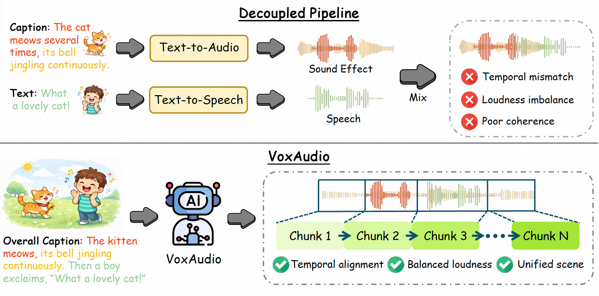
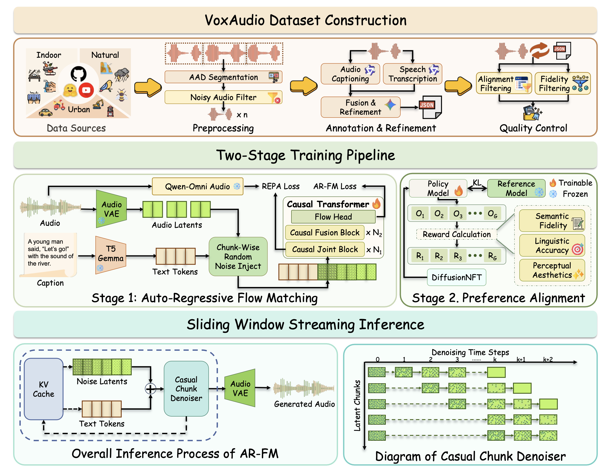
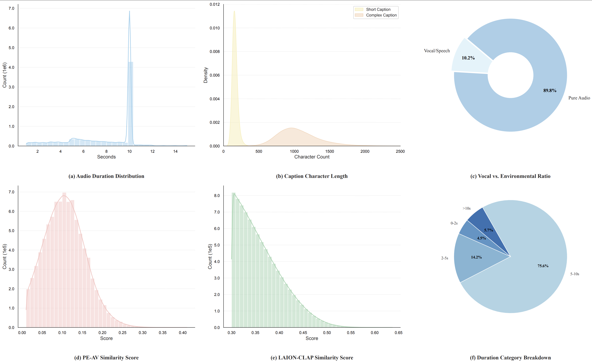

# VoxAudio: Vocalized Audio Synthesis via Multi-Reward Autoregressive Flow Matching


## Abstract

Vocalized audio synthesis is a practical requirement for unified scene audio generation, where a model must render both explicit speech and environment audio for downstream applications such as virtual worlds and multimodal assistants. Current Text-to-Audio (T2A) frameworks frequently degrade speech or rely on post-hoc composition, limiting holistic control and real-time use.
We present VoxAudio, a causal autoregressive flow matching model for unified and controllable vocalized audio generation. VoxAudio is trained on a large-scale corpus with captions that explicitly quote transcribed speech, enabling direct supervision of lexical content within realistic acoustic contexts. For streaming, we formulate autoregressive flow matching with chunk-level causality and independent per-chunk noise scheduling, and perform sliding-window inference with KV caching to achieve real-time, high-quality generation. We further incorporate REPresentation Alignment (REPA) to accelerate convergence and strengthen semantic grounding, and adopt a multi-reward Negative-aware FineTuning (NFT) strategy to optimize semantic coherence, linguistic precision, and aesthetic quality via aggregated reward signals. Experiments show that VoxAudio achieves state-of-the-art performance on objective metrics, producing articulate speech synchronized with complex environmental soundscapes.



## Model Architecture

Example of running the basic inference script:

```bash
./inference.sh
```



## Dataset & Benchmark

We are in the process of curating our dataset and benchmark. They will be made publicly available to the research community when paper is accepted.

You can find a representative sample of the benchmark in the file `./data/voxaudio_test.jsonl`.



## Our DemoPage
Our demo page is hosted at: [https://voxaudio.github.io/](https://voxaudio.github.io/).
